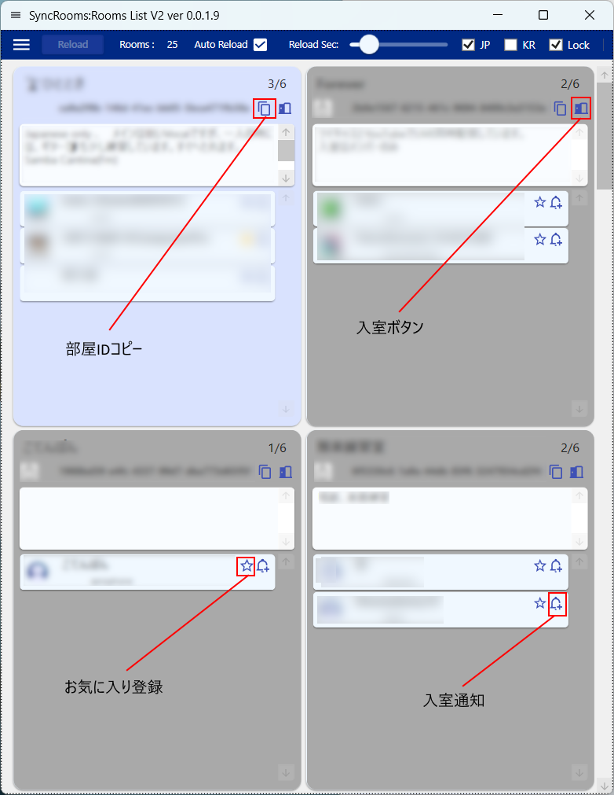

# SyncRooms
## なにするもの？
[YAMAHA SyncRoom](https://syncroom.yamaha.com) の部屋一覧をWindowsアプリで作りまして。

## 使い方
[ここ](https://github.com/XiAce-Lite/SyncRooms/releases/latest)から最新版の  SyncRooms_vX.X.X.X.zip ファイルを落してきて、適当なフォルダに解凍して、あとは実行するだけ。

インストーラーも付けてみました。install.zipの中身を解凍して、Setup.exeを実行します。.msiを叩いてもいけるはず。

Zipの中のファイルだけで動くはずですが、なんぞ.net 関連のファイルが要るかもです。バージョンアップの場合は、.exeファイルだけの配置でいいはずです。

## 出来る事。
- 公式ページのAPIから拾ってますんで、ブロック・被ブロック状態でも全部見れます。
- 公式のお気に入りとは別途、お気に入りユーザに☆クリックで登録出来ます。再度クリックで解除します。
- お気に入りユーザは、リストの上の方に表示します。
- オートリロード機能あり。
- ベルアイコンをクリックすると、そのユーザが入室した場合に、Windowsの通知機能で通知します。
- 連結申請があった場合にも、Windowsの通知機能で通知します。
- パネル表示とリスト表示が切り替えられます（サンプル画面はパネル表示）
- 部屋IDコピー機能（パネル表示時のみ）
- 直接入室ボタン（パネル表示時のみ。SyncRoomが立ち上がっていることが前提。入室用のAPIをコールしてるだけ）
- 各種絞り込み（公式の絞り込みと同じ。ヘッダー部のチェックボックスにて）

## その他
- このツールを使った事でなんぞ不利益や不具合が発生しても、責任取りません。取れません。
- 多分、Windows依存の機能はないので、誰かMac版作って。MAUIは諦めた。
